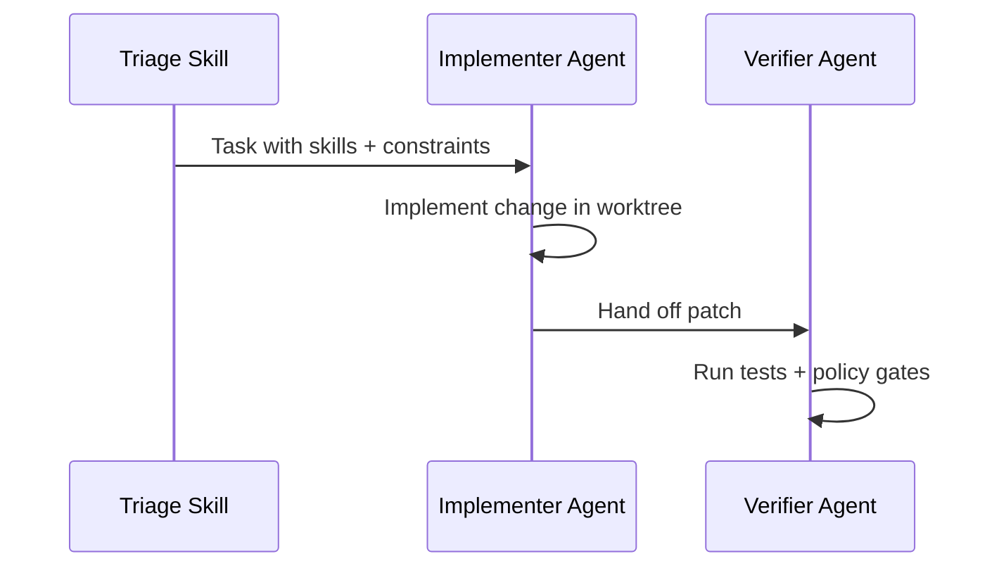

# Loop Design — {pattern-slug}

> Generated by the `loop-design` skill. Review every section before scaffolding
> with `loop-init . --pattern {pattern-id} --tool {tool}`.

## Goal & Scope

- **Goal:** {one testable sentence}
- **Non-goals:** {what this loop will explicitly not do}
- **Watched scope:** {repos / branches / PRs / tickets}

## Agent Shape

- **Decision:** {single agent + tool | multi-agent (maker/checker split)}
- **Justification:** {why — default is single-agent; multi-agent must earn its
  complexity. If single-agent, say so plainly and skip Orchestration below.}

## Orchestration (only if Agent Shape above is multi-agent)

- **Pattern:** {maker-checker | parallel:N | debate:R}
- **Cost estimate** (`npx @cobusgreyling/loop-cost --pattern {pattern-id} --level {level} --orchestration {mode}`):
  - Realistic: {tokens/run} · {tokens/day}
  - Action (worst case): {tokens/run} · {tokens/day}

Diagram — redraw to match the chosen pattern; the sequence below is the
maker-checker shape only:

## Autonomy Progression (L1 -> L2 -> L3)

Exit criteria are what `loop-audit . --suggest` actually scores against — not a
separate rubric to keep in sync by hand.

| Level | What it means | Exit criteria |
|-------|----------------|----------------|
| **L1** | Report-only | Triage skill + state file wired; N clean report-only runs with no false positives |
| **L2** | Assisted auto-fix with verifier | Verifier isolates tests in a worktree (`loop-worktree`); N successful assisted fixes; zero `loop-gate` denylist hits |
| **L3** | Unattended-capable (human gates still apply) | Cost observability proven (`loop-budget.md` + `loop-run-log.md`); `gate.yaml` human gates satisfied; proven loop activity over time, not just scaffolding on disk |

## Safety

- **Denylist / auto-merge allowlist:** `gate.yaml` (enforced by `loop-gate check`)
- **Token budget:** `npx @cobusgreyling/loop-cost --pattern {pattern-id} --level {level}`, wired via `loop-context --budget-from-pattern {pattern-id} --budget-level {level}` (the level must match, or the cap silently falls back to L1's)
- **Circuit breaker:** stagnation {n}, no-progress {n}, max-iterations {n} (defaults unless a reason is given to override)
- **Multi-loop collisions:** if this pattern shares files with another scheduled loop, `loop-worktree lock --paths <globs> --owner {pattern-id}` before creating a worktree

## Next steps

1. `npx @cobusgreyling/loop-init . --pattern {pattern-id} --tool {tool}` to scaffold.
2. `npx @cobusgreyling/loop-audit . --suggest` to confirm L1 readiness.
3. Operate at L1 for the number of runs above, then re-run `loop-audit` before
   considering L2. Do not skip a level on a hunch.
